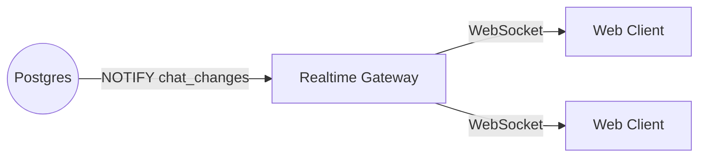

# Realtime Gateway

A lightweight NestJS WebSocket gateway for realtime chat notifications in Vero.

## Overview

The Realtime Gateway monitors PostgreSQL for `chat_changes` notifications (generated by triggers or app logic) and broadcasts them to connected clients authenticated via Clerk.

## Architecture



## Features

- **Native WebSockets**: Uses `@nestjs/platform-ws` for standard WebSocket support (no Socket.io).
- **Postgres Listeners**: Uses `pg` to `LISTEN` for notifications.
- **Clerk Authentication**: Verifies JWT tokens from query parameters (`?token=...`).

## Setup

### Environment Variables

Copy `.env.example` to `.env` in this directory (the gateway does not read the monorepo root env):

```bash
cp .env.example .env
```

Required variables:

- `PORT`: Server port (default 3001)
- `DATABASE_URL_UNPOOLED`: PostgreSQL connection string (must be unpooled for LISTEN/NOTIFY)
- `CLERK_SECRET_KEY`: Clerk secret key for token verification
- `CORS_ORIGINS`: Allowed origins (e.g. `http://localhost:3000`)

### Installation

```bash
bun install
```

## Running

```bash
# Development
bun run start:dev

# Production
bun run build
bun run start:prod
```

## Protocol

### Connection

Connect to `ws://host:port/ws?token=<clerk_jwt>`.

### Messages

**Server -> Client**

- `subscribed`: `{ type: 'subscribed', payload: { userId: '...' } }`
- `chat_changed`: `{ type: 'chat_changed', payload: { userId, chatId, action, ... } }`
- `pong`: `{ type: 'pong', id: '...' }`

**Client -> Server**

- `ping`: `{ type: 'ping', id: '...' }`
